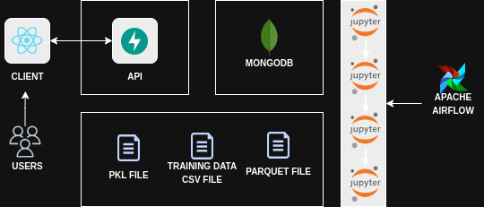

# Datathon

## Descrição

O **Datathon** é um projeto de conclusão de curso da pós de ML da FIAP, que consiste em um sistema de recomendação desenvolvido para analisar e sugerir insights com base em dados. Ele combina uma API, um cliente web e um serviço de treinamento de modelos para oferecer recomendações personalizadas.

## Desenho de Arquitetura



## Estrutura de Diretórios

- **api**: Serviço construído utilizando FastAPI. Consome os artefatos gerados pelo train_service para gerar as recomendações para usuários logados e não logados.

- **client**: Aplicação frontend (vite react), simulando a interface de acordo com a proposta do projeto (referência: globo).

- **train_service**: Esse serviço contém os notebooks de treinamento dos modelos e a orquestração DAG (airflow), passando pelos fluxos necessários, ex: pré-processamento, treinamento e avaliação, e com isso geramos os artefatos parquets e principalmente o pickle para consumo em serviços (ex: apis).

- **shared-files/**: Contém arquivos compartilhados entre os serviços do sistema.

- **mongo-data/**: Diretório utilizado para armazenar dados persistentes do MongoDB.

## Como rodar e acessar

Para iniciar o sistema, execute o seguinte comando na raiz do projeto **Datathon**:

```
docker-compose up -d
```

Isso irá subir todos os serviços necessários para o funcionamento do sistema.

### Endpoints Principais

#### API

- URL: <http://localhost:8000>

#### Client (Interface do Usuário)

Por enquanto, o acesso ao cliente web requer a identificação do IP de rede. Para recuperar o endereço correto, execute:

```
docker logs client
```

Acesse o endereço retornado, no formato:

```
Network: http://xxx.xx.x.x:xxxx/
```

#### Train Service

- URL: <http://localhost:8081/>

## Considerações Finais

Este projeto foi desenvolvido como parte do trabalho de conclusão de curso e pode ser expandido com melhorias futuras. Qualquer contribuição ou sugestão é bem-vinda!
